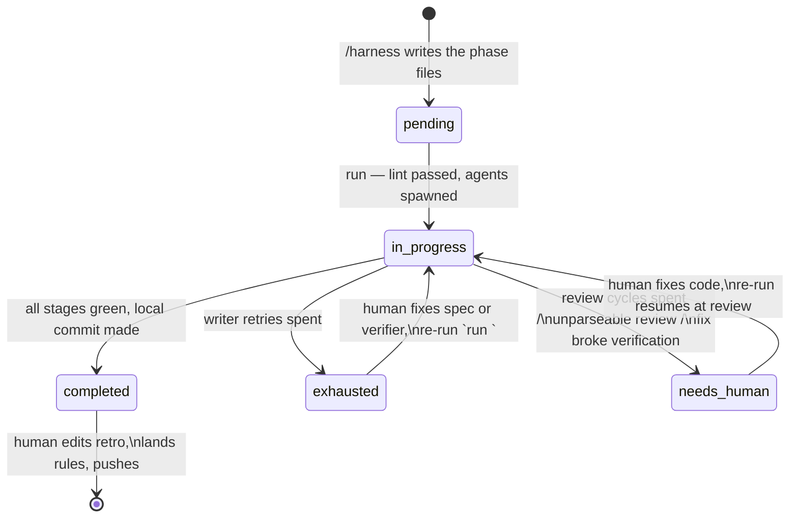
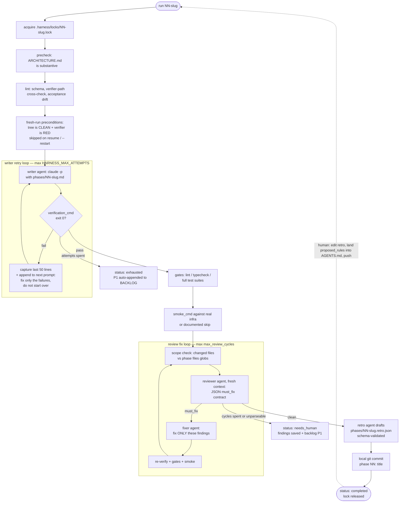

# Harness Guide

This repo uses a small in-repo harness to drive AI-assisted development
phase by phase. It is vendored from
[`chartmetric/harness-template`](https://github.com/chartmetric/harness-template)
and owned here — edit it in place; there is no upstream dependency to
update. See ADR-004 for why, and for what was changed on the way in.

The harness has four moving parts:

1. **AGENTS.md** at the root — the agent entry point. `CLAUDE.md` is a
   per-machine symlink to it, so Claude Code and the cross-agent tools
   read the same file.
2. **`harness.config.json`** — every project-tunable knob: doc gates,
   test filename conventions, retry/review budgets, commit format.
   Defaults live in `scripts/_config.py`.
3. **`.agents/`** — slash commands and `settings.json` with the
   per-Bash hook. Claude Code sees these through the `.claude`
   symlink; `.agents/` is the tracked location.
4. **`scripts/`** — the Python phase runner (`execute.py`, a thin entry
   over the `scripts/harness/` package — one module per concern) and
   the hook script `hooks/dangerous_cmd_guard.py`.

## How test-first is enforced here

The upstream template ships a second hook, `tdd_guard.py`, which denies
edits to any source file lacking a same-named test. It is deliberately
**not** vendored. It is a filename-existence check that cannot tell an
untested module from an untestable one, and this repo already covers
the same ground three better ways:

- The **RED-verifier precondition** refuses to start a phase whose
  `verification_cmd` already passes — real test-first enforcement at
  phase granularity, deterministic, no false positives.
- The **review stage** flags missing tests with judgment about whether
  a given file warrants one.
- **husky pre-commit** and CI run `pnpm typecheck` and `pnpm test`, so
  no phase commits with failing tests.

A worked example of a complete phase (JSON + md + retro) lives in
`docs/EXAMPLE_PHASE.md`.

## System overview

```
┌───────────────────────────────────────────────────────────────────────┐
│  HUMAN + interactive Claude Code session (the "driver")               │
│                                                                       │
│   /feature-intake  plain-language ask → ADR-grounded PRD entry       │
│   /harness       propose + lint phases, confirm, trigger runs        │
│   /backlog       triage deferred work                                │
│   /harness-review  rubric review of the current branch               │
│   /phase-review  manual re-audit of a phase                          │
│                                                                       │
│   after each run: edit the drafted retro, land good proposed_rules   │
│   into AGENTS.md `## Learned rules`, then push (pushing is human)    │
└──────────────────────┬────────────────────────────────────────────────┘
                       │  python3 scripts/execute.py run <id>
                       ▼
┌───────────────────────────────────────────────────────────────────────┐
│  PHASE RUNNER  (scripts/execute.py → scripts/harness/ package)        │
│                                                                       │
│   precheck → lint → preconditions → write ⟲ verify → gates → smoke   │
│            → scope-check → review ⟲ fix → retro draft → local commit │
│                                                                       │
│   spawns fresh `claude -p` subprocesses, each with HARNESS_PARENT=1  │
│   (they cannot invoke the runner) and a per-role command/model:      │
│                                                                       │
│     writer ──► implements the phase spec                             │
│     fixer  ──► addresses review must_fix findings                    │
│     reviewer ► audits the diff, JSON findings contract               │
│     retro  ──► drafts the post-phase retrospective                   │
└───────┬──────────────────────────────────────┬────────────────────────┘
        │ reads / writes (atomic)              │ append-only, gitignored
        ▼                                      ▼
  phases/<id>.json     phase state,      .harness/audit.jsonl   events +
                       stage, resumable                         hook denies
  phases/<id>.md       writer prompt     .harness/transcripts/  full agent
  phases/<id>.retro    drafted retro       <id>/<role>-N.log    exchanges
        .json                            .harness/locks/        one run per
  docs/BACKLOG.md      P1 on exhaustion    <id>.lock            phase

┌───────────────────────────────────────────────────────────────────────┐
│  HOOK  (.agents/settings.json, PreToolUse — fires on EVERY Bash call │
│  of the driver session AND every spawned agent)                      │
│                                                                       │
│   dangerous_cmd_guard.py rm -rf / force-push / drizzle-kit push /    │
│                          railway down / Stripe mutation / … → deny   │
└───────────────────────────────────────────────────────────────────────┘
```

Two loops make the system compound over time:

- **Inner loop (per attempt, automated):** writer output is never
  trusted — a deterministic verifier decides, failures feed the next
  attempt.
- **Outer loop (per phase, human-in-the-loop):** the retro's
  `proposed_rules` accrete into the `## Learned rules` section of
  AGENTS.md, which every future writer and reviewer reads — each phase
  makes the next one safer.

## Phase status lifecycle



## Phases

A phase is a JSON file under `phases/` plus a markdown spec:

```json
{
  "id": "NN-short-slug",
  "title": "human-readable title",
  "status": "pending | in_progress | completed | exhausted | needs_human",
  "depends_on": ["other-phase-id"],
  "acceptance": ["criterion 1", "criterion 2"],
  "files": ["glob/of/files/this/phase/touches/**"],
  "gates": ["pnpm typecheck", "pnpm test", "pnpm check:generated"],
  "verification_cmd": "pnpm test --filter=api -- list-artists",
  "smoke_cmd": "pnpm --filter api test:integration",
  "security_review": false,
  "notes": ""
}
```

- `phases/<id>.md` is the writer prompt, following
  `phases/PHASE_TEMPLATE.md`. Its `## Acceptance` section must list the
  same number of criteria as the JSON `acceptance` array — the `lint`
  stage enforces this (the two have drifted apart in practice).
- `verification_cmd` is the machine check the retry loop runs after
  every writer attempt (defaults to
  `default_verification_cmd` from the config).
- `gates` are broader shell commands (lint, typecheck, full test
  suites) run once after verification passes.
- `smoke_cmd` is optional: an end-to-end exercise of the phase's
  orchestration against real infra (consume loops, HTTP routes wired to
  deps, cross-process flows). Absence means the phase ships no
  orchestration. File-existence checks in `verification_cmd` are NOT a
  substitute — unwired orchestration passes them cleanly.

  **A phase that changes a ClickHouse query always needs one**, even
  when it adds no route and wires nothing new. Unit tests here assert
  the SQL the builder emits; they cannot tell whether ClickHouse
  accepts it. Ambiguous identifiers, ambiguous join keys, and
  `Replacing*` reads missing `FINAL` all pass a string assertion and
  fail against a real schema. Execute a matrix — every filter, every
  sort, the count/list sibling pair, empty values, include/exclude
  modes, joined enrichment paths — and record the ClickHouse version
  and schema snapshot used. Assert deltas against a baseline captured
  through the same reader, never absolute counts: warehouse population
  changes underneath you, and a test pinned to today's match rate is a
  flake waiting to happen.

- `security_review: true` adds a threat-model addendum to the review
  stage's brief. Flag launch, auth, payment, and PII-touching phases.
- Optional per-phase overrides: `max_attempts` (writer retry budget),
  `max_review_cycles` (review→fix rounds), and `agent_cmds` (per-role
  agent command, e.g. a stronger reviewer for a hard phase).
- The runner adds bookkeeping fields as it works (`stage`, `attempts`,
  `run_started_at`, `smoke_result`, `review_findings`,
  `out_of_scope_files`) — leave them alone; they power resume and the
  retro draft.

## Per-role models

Four agent roles are spawned by the pipeline: **writer**, **fixer**,
**reviewer**, **retro**. Each resolves its command independently, most
specific wins:

1. `HARNESS_<ROLE>_CMD` env var
2. `HARNESS_CLAUDE_CMD` env var (global)
3. phase JSON `agent_cmds[role]`
4. `harness.config.json` `agent_cmds[role]`
5. built-in default (`claude --permission-mode auto --model opus`)

All roles default to Opus. To trade cost for speed, downgrade the
cheap-summarization role first (`retro`), the bounded-audit role second
(`reviewer`); keep `writer`/`fixer` on the strongest model — they
produce the code. Planning has no entry here: `/harness` runs in your
interactive session, so its model is whatever the session uses.

## CLI

| Command                                  | Purpose                                                              |
| ---------------------------------------- | -------------------------------------------------------------------- |
| `python3 scripts/execute.py doctor`      | first-run environment check: git, config, agent binary, hooks wiring |
| `python3 scripts/execute.py precheck`    | verify required docs have substantive content (exit 2 = blocked)     |
| `python3 scripts/execute.py status`      | list phases + status (+ resume stage for in-progress)                |
| `python3 scripts/execute.py current`     | print id of next non-completed phase                                 |
| `python3 scripts/execute.py lint <id>`   | pre-flight the phase JSON + .md (no agents spawned)                  |
| `python3 scripts/execute.py run <id>`    | **the one-shot pipeline** (below)                                    |
| `python3 scripts/execute.py start <id>`  | writer retry loop only (debug)                                       |
| `python3 scripts/execute.py finish <id>` | manual finish: retro + gates + smoke (recovery)                      |
| `python3 scripts/execute.py review <id>` | review stage only (debug)                                            |
| `python3 scripts/execute.py retro <id>`  | draft the retro only (debug)                                         |

## The one-shot pipeline (`run`)

`run <id>` executes the whole phase with no operator command in
between:

The diagram below is one phase, end to end. The two highlighted cycles
are the heart of the harness: the **writer retry loop** (agent writes,
deterministic verifier judges, errors feed the next attempt) and the
**review fix loop** (fresh-context reviewer finds, fixer fixes,
everything re-proves).



Every failure edge is a resume point: the phase JSON records the last
completed stage, so re-running `run <id>` continues from where it
stopped instead of starting over.

Every stage persists to the phase JSON (`stage` field, written
atomically), so an interrupted or failed run **resumes where it
stopped** — re-run `run <id>`. Use `--restart` to force a from-the-top
run. A per-phase lock (`.harness/locks/<id>.lock`) refuses concurrent
runs of the same phase; a lock left by a crashed process is stolen
automatically. Every spawned subprocess has a timeout ceiling
(`agent_timeout_sec` / `command_timeout_sec` in the config) so a hung
command cannot hang the pipeline.

### Stage notes

- **lint** — catches the two historical footguns before any tokens
  burn: a typo'd file path in `verification_cmd` (fails silently,
  burns the whole retry budget) and JSON↔MD acceptance drift. Also
  validates schema/types and that `depends_on` references exist.
- **fresh-run preconditions** — a fresh `run` refuses a dirty working
  tree (pre-existing changes would be attributed to the writer by the
  scope guard and reviewer; `--allow-dirty` overrides) and refuses a
  verifier that is already green (phase-level TDD: `verification_cmd`
  must fail before the work exists, or it proves nothing — the
  empty-workspace test-runner false-positive class;
  `HARNESS_ALLOW_GREEN_VERIFIER=1` overrides). Resumes and `--restart`
  skip both checks — mid-phase dirt and green verifiers are the work.
- **write** — the writer agent (`claude -p`) is invoked with the
  phase's `.md` as the prompt. Its stdout is not trusted for success;
  the verifier is the source of truth. On attempt 2+ the prompt is
  augmented with the previous failure tail. Known permission/auth
  failure strings short-circuit to a retry (a writer that never edited
  anything must not produce a false verifier pass).
- **review** — a fresh-context agent audits the uncommitted working
  tree against the phase spec and the repo conventions. The output
  contract is JSON: `{"must_fix": [...], "should_fix": [...],
"backlog_worthy": [...]}` (a legacy `MUST_FIX:` text marker is kept
  as a fallback for hand-run reviewers). Before each cycle the
  **scope guard** diffs the changed files against the phase's `files`
  globs and feeds out-of-scope files into the brief as scope-creep
  candidates. must_fix findings are dispatched to a fix agent, then
  verification + gates + smoke rerun, then re-review. After
  `max_review_cycles` fix rounds the phase is marked `needs_human` and
  a P1 lands in the backlog. An unparseable review also goes to
  `needs_human` — silently passing a bad review is worse than stopping.
- **retro** — the runner assembles the mechanical fields (duration,
  hook-deny counts from the audit log, diff stat, smoke result) and an
  agent drafts the judgment fields (surprises, proposed_rules,
  followups). The draft is schema-validated; on repeated failure a
  mechanical skeleton is written instead. Either way the file carries
  `"drafted_by": "agent"` — **the human edits it after the run**,
  especially `proposed_rules`, which feed the AGENTS.md accretion loop.
- **commit** — `git add -A` + a local commit using
  `commit_message_format`. Never pushes.

## The operator loop (day-to-day usage)

What actually happens per phase, for someone new to the harness:

1. **Plan** — if the ask arrived as a plain-language description rather
   than a technical PRD (a PM or designer's request, for example), run
   `/feature-intake` first: it grounds the ask in `docs/ADR.md` and
   `docs/ARCHITECTURE.md`, stops to ask the user whenever it hits a
   missing or conflicting architectural decision, and writes the
   result into `docs/PRD.md`. Then, in your interactive session,
   `/harness` proposes the next phase from that PRD (or you write
   `phases/NN-slug.{json,md}` by hand following
   `phases/PHASE_TEMPLATE.md`). `execute.py lint <id>` checks it costs
   nothing to validate.

   `docs/PRD.md` is an append-only log of feature entries, one `##` per
   feature, and does not exist until the first `/feature-intake` run.
   That is why it sits in `advisory_docs` rather than `required_docs`:
   gating on it would fail the first run of a repo with no features
   logged yet, so precheck reports its absence and lets the run proceed.
   Repository and tooling work needs no PRD entry at all —
   `docs/ARCHITECTURE.md` and `docs/ADR.md` govern it.

2. **Run** — `python3 scripts/execute.py run <id>`. Walk away; the
   pipeline writes, verifies, gates, smokes, reviews, fixes, drafts the
   retro, and commits locally. If it stops (`exhausted` /
   `needs_human` / gate failure), `status` shows where, transcripts
   show why, and re-running `run <id>` resumes there.
3. **Harvest** — read the drafted retro. Correct its judgment fields,
   then land the `proposed_rules` worth keeping into the
   `## Learned rules` section of AGENTS.md.
   This step is the compounding loop — skip it and the harness stops
   getting smarter.
4. **Ship** — inspect the local commit, push, open the PR. One phase =
   one commit = one PR.

## Configuration reference (`harness.config.json`)

Defaults live in `scripts/_config.py`; known keys are type-checked at
load (a wrongly-typed value fails at harness entry, not mid-run).

| Key                        | Default                   | Controls                                         |
| -------------------------- | ------------------------- | ------------------------------------------------ |
| `project_name`             | `my-project`              | naming in agent prompts                          |
| `required_docs`            | `docs/ARCHITECTURE.md`    | files the precheck gates on                      |
| `advisory_docs`            | `docs/PRD.md`             | files precheck reports but never blocks on       |
| `agents_file`              | `AGENTS.md`               | conventions file agents read                     |
| `agents_sections`          | `[2, 3, 4]`               | sections the precheck gates on                   |
| `min_substantive_lines`    | `3`                       | precheck threshold per doc/section               |
| `default_verification_cmd` | `pnpm test`               | verifier when a phase sets none                  |
| `max_attempts`             | `5`                       | writer retry budget                              |
| `agent_timeout_sec`        | `3600`                    | ceiling per spawned agent                        |
| `command_timeout_sec`      | `1800`                    | ceiling per verifier/gate/smoke/git call         |
| `max_review_cycles`        | `2`                       | review→fix rounds before `needs_human`           |
| `agent_cmds`               | `{}`                      | per-role agent commands (see Per-role models)    |
| `test_file_conventions`    | `*.test.ts`, `*.test.tsx` | lint's verifier-path check                       |
| `backlog_path`             | `docs/BACKLOG.md`         | where exhaustion P1s land                        |
| `commit_message_format`    | `phase({num}): {title}`   | auto-commit subject (`{id}`, `{num}`, `{title}`) |
| `commit_trailers`          | `[]`                      | lines appended to every phase commit             |

## Environment variables

- `HARNESS_MAX_ATTEMPTS` — overrides the phase's `max_attempts`
  (default from config, 5).
- `HARNESS_CLAUDE_CMD` — global command for all spawned agents;
  defaults to `claude --permission-mode auto --model opus`. Point it
  at a stub in tests.
- `HARNESS_WRITER_CMD` / `HARNESS_FIXER_CMD` / `HARNESS_REVIEWER_CMD` /
  `HARNESS_RETRO_CMD` — per-role overrides (beat the global env).
- `HARNESS_SKIP_SMOKE=<reason>` — documented smoke skip. The pipeline
  records the reason and injects a `smoke skipped: <reason>` followup
  into the drafted retro; the manual `finish` path instead refuses
  unless the retro already documents it.
- `HARNESS_ALLOW_GREEN_VERIFIER=1` — let a fresh run proceed even
  though `verification_cmd` already passes (normally refused as
  tautological).
- `HARNESS_PARENT=1` — set internally on every spawned agent. Any
  `execute.py` invocation with it set refuses at entry: agents must not
  drive harness subcommands (a writer once self-finished its own
  phase, skipping review).

## Recovering a `needs_human` phase

The review stage parks a phase as `needs_human` when MUST_FIX findings
survive `max_review_cycles`, when the reviewer's output is unparseable,
or when a fix agent breaks verification. To recover:

1. Read `review_findings` in the phase JSON and the full exchanges in
   `.harness/transcripts/<id>/`.
2. Fix the code by hand (or adjust the phase spec if the finding shows
   the spec was wrong).
3. Re-run `run <id>` — it resumes at the review stage (the last
   completed stage is still recorded), re-reviews your fix, and
   continues through retro + commit. Use `--restart` only if you want
   the writer to redo the phase from scratch.

The same resume applies to `exhausted` phases after you fix whatever
blocked the writer (typically the spec or the verifier).

## Retro schema

Each phase ends with `phases/<id>.retro.json`:

```json
{
  "phase_id": "01-foundation",
  "duration_min": 45,
  "gates_fired": [
    {
      "hook": "dangerous_cmd_guard",
      "deny_count": 2,
      "allow_count": 38,
      "examples": ["rm -rf /tmp/build (denied)"]
    }
  ],
  "git_diff_summary": "12 files changed, 340 insertions(+), 22 deletions(-)",
  "tests_added": 14,
  "tests_passing_total": 84,
  "drafted_by": "agent",
  "smoke_run": {
    "ts": "2026-01-01T00:00:00+00:00",
    "result": "pass",
    "cmd": "..."
  },
  "surprises": ["..."],
  "proposed_rules": [{ "target": "AGENTS.md", "diff": "..." }],
  "followups": ["P2: ..."]
}
```

Validation (enforced at `finish` and on the pipeline's draft): ≤ 80
lines, six required keys, `phase_id` matches, `gates_fired` items carry
hook/deny_count/allow_count/examples, and — if present — `smoke_run.ts`
must be a real ISO timestamp (placeholders are refused) with `result`
in pass/fail/skipped.

The retro is the harness's feedback channel: `proposed_rules` that
survive human review land in the `## Learned rules` section of
AGENTS.md, so every phase makes the next one safer.

## Hook

Configured in `.agents/settings.json` (which Claude Code reads through
the `.claude` symlink). PreToolUse — it fires before the tool runs and
can deny the call.

### `dangerous_cmd_guard.py` (matcher: `Bash`)

Blocks destructive shell commands by regex match: `rm -rf /`,
force-push to main/master, `git reset --hard HEAD~`, `git clean -fd`,
`drop table`, `truncate table`, `kubectl delete`, package publishes,
`mkfs`, `dd` to block devices, fork bomb. Conservative — routine
commands pass silently.

Repo-specific additions, from the AGENTS.md security rules:
`drizzle-kit push` (schema change with no migration file),
`railway down` / `railway … delete` (deployed infrastructure),
Stripe product and entitlement mutations, and `DELETE FROM` with no
`WHERE` clause.

The guard matches the whole command string, so a denied pattern
appearing anywhere in it is blocked — including inside a heredoc, a
commit message, or documentation text that merely mentions the
command. When that happens, put the text in a file and pass the path
(`git commit -F <file>`) rather than rewording to dodge the pattern.
Erring toward the false positive is the intended trade.

Long-form flags (`rm --recursive --force`), split flag groups
(`rm -r -f`), and refspec force pushes (`git push origin +main`) are
normalized before matching. Still a tripwire, not a sandbox:
shell-encoded equivalents, here-docs, eval, and SSH-remote commands
pass through. It defeats fat-finger and runaway-loop mistakes, not
adversaries. Branch protection, IAM, and DB permissions are the other
layers.

### Audit log

Every deny decision and every runtime event (`retry_triggered`,
`retry_exhausted`, `smoke_passed`, `review_completed`, `scope_check`,
`run_started`, …) is appended to `.harness/audit.jsonl` (machine-local,
gitignored). Writes are fail-open. The retro drafter reads this log to
ground `gates_fired`.

### Transcripts

Every agent exchange (prompt + full output, all roles) is saved to
`.harness/transcripts/<phase>/<role>-N.log` — the pipeline's error
feedback keeps only a 500-char tail, so this is where you debug an
exhausted phase or an odd review. Machine-local, gitignored, fail-open.

## Backlog

Non-blocking followups go in `docs/BACKLOG.md` under `## Active` with a
priority tag (P1/P2/P3). The harness auto-appends P1 items on retry
exhaustion and review-cycle exhaustion. Items are only addressed when
the user explicitly invokes `/backlog` or references them.

## Where to extend

| Want to…                                              | Edit                                                   |
| ----------------------------------------------------- | ------------------------------------------------------ |
| Change doc gates, budgets, conventions, commit format | `harness.config.json`                                  |
| Add a dangerous-command pattern                       | `scripts/hooks/dangerous_cmd_guard.py` (`DENYLIST`)    |
| Add a slash command                                   | new file in `.agents/commands/`                        |
| Add a phase-level gate                                | the phase JSON's `gates` array                         |
| Change the review contract                            | `REVIEW_BRIEF_TEMPLATE` in `scripts/harness/review.py` |
| Add a doctor check                                    | `scripts/harness/doctor.py`                            |

## Tests

The harness ships its own tests (stdlib `unittest`, no third-party
deps):

```bash
python3 -m unittest discover tests -v
```

Each test runs in an isolated tmpdir so audit-log writes don't pollute
the repo. CI runs the same command on every PR and push to main.

## Conventions

- Phases use two-digit numbering (`01-foundation`) for lexicographic
  sort; sub-phases append a letter (`06b-...`).
- One phase = one commit = one PR.
- Architecture decisions go in `docs/ADR.md` _before_ the phase that
  depends on them.
- Skeleton docs (`ARCHITECTURE.md`, `ADR.md`) are filled
  collaboratively with the user, not autonomously — the precheck
  enforces that they are filled before any phase runs.
